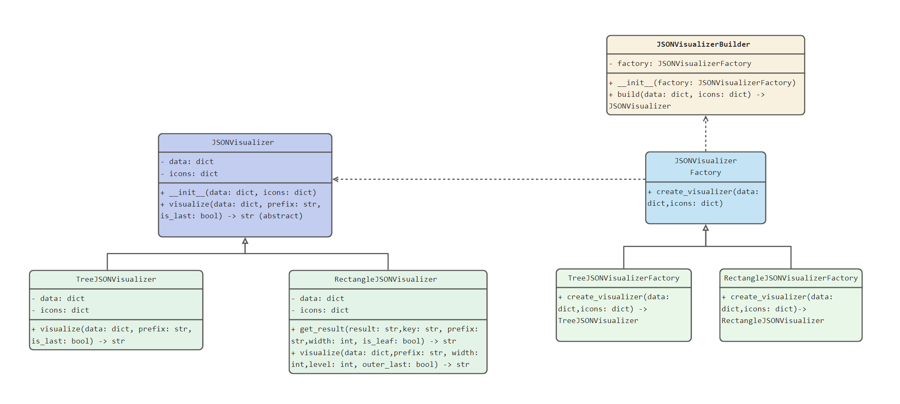
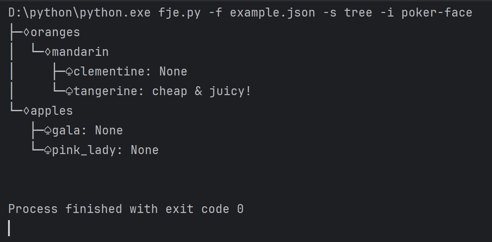
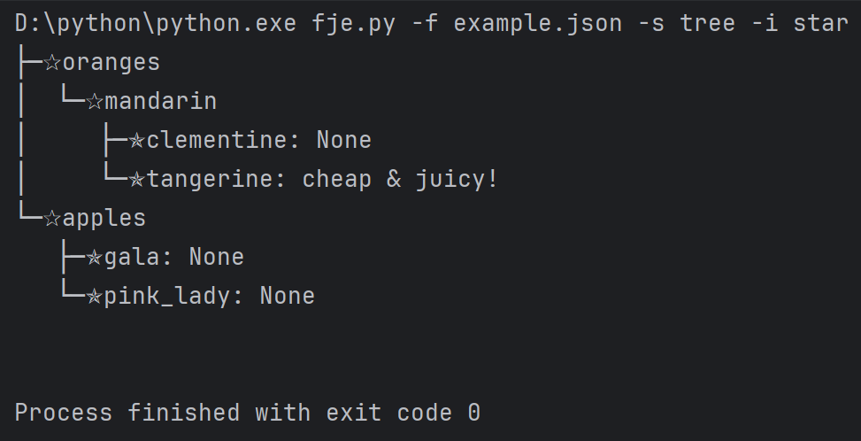
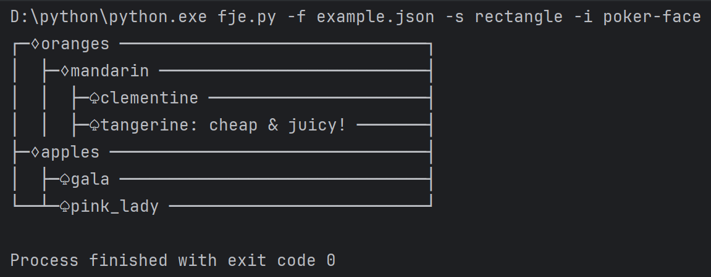
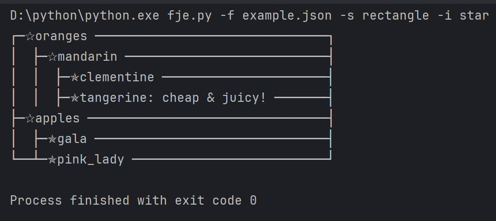

## 说明：
1. 工厂模式：定义了 `JSONVisualizerFactory` 抽象工厂类和具体的 `TreeJSONVisualizerFactory`、`RectangleJSONVisualizerFactory`工厂，  
定义了 `JSONVisualizer` 抽象类作为接口， `TreeJSONVisualizer`、`RectangleJSONVisualizer` 是具体实现（产品）。  
添加新的工厂，即可添加新的风格
2. 建造者模式：使用 `JSONVisualizerBuilder` 类，构建具体的可视化对象，同时也可以扩展实现更丰富的功能。
3. 命令行界面：使用 `argparse` 来处理命令行参数。
4. 配置文件`icons.json`: 定义不同的图标族
## 类图

## 四个截图




## 运行示例： 
```shell 
python fje.py -f path/to/your/file.json -s tree -i poker-face -c icons.json
```
```shell 
python fje.py -f example.json -s tree -i poker-face
```
```
├─♢oranges
│  └─♢mandarin
│     ├─♤clementine: None
│     └─♤tangerine: cheap & juicy!
└─♢apples
   ├─♤gala: None
   └─♤pink_lady: None
```
```shell 
python fje.py -f example.json -s tree -i star
```
```
├─✰oranges
│  └─✰mandarin
│     ├─✯clementine: None
│     └─✯tangerine: cheap & juicy!
└─✰apples
   ├─✯gala: None
   └─✯pink_lady: None
```
```shell 
python fje.py -f example.json -s tree 
```
```
├─ oranges
│  └─ mandarin
│     ├─ clementine
│     └─ tangerine: cheap & juicy!
└─ apples
   ├─ gala
   └─ pink_lady

```
或者

```shell 
python fje.py -f path/to/your/file.json -s rectangle
```
```shell 
python fje.py -f example.json -s rectangle 
```
```
┌─ oranges ───────────────────────────────┐
│  ├─ mandarin ───────────────────────────┤
│  │  ├─ clementine ──────────────────────┤
│  │  ├─ tangerine: cheap & juicy! ───────┤
├─ apples ────────────────────────────────┤
│  ├─ gala ───────────────────────────────┤
└──┴─ pink_lady ──────────────────────────┘
```
```shell 
python fje.py -f example.json -s rectangle -i poker-face
```
```
┌─♢oranges ───────────────────────────────┐
│  ├─♢mandarin ───────────────────────────┤
│  │  ├─♤clementine ──────────────────────┤
│  │  ├─♤tangerine: cheap & juicy! ───────┤
├─♢apples ────────────────────────────────┤
│  ├─♤gala ───────────────────────────────┤
└──┴─♤pink_lady ──────────────────────────┘
```
```shell 
python fje.py -f example.json -s rectangle -i star
```
```
┌─✰oranges ───────────────────────────────┐
│  ├─✰mandarin ───────────────────────────┤
│  │  ├─✯clementine ──────────────────────┤
│  │  ├─✯tangerine: cheap & juicy! ───────┤
├─✰apples ────────────────────────────────┤
│  ├─✯gala ───────────────────────────────┤
└──┴─✯pink_lady ──────────────────────────┘
```
可以方便地扩展为支持更多的可视化风格，只需添加新的具体工厂类和具体实现类即可。


## 设置命令别名
要使 `fje` 命令可以运行 `fje.py` 脚本，可以将 `fje.py` 脚本放置在系统的`PATH`中，或者创建一个命令别名。

**方法1：使用别名（仅限当前终端会话）**  
在终端中运行以下命令：
```shell
alias fje='python /path/to/fje.py'
```
确保用实际路径替换 `/path/to/fje.py`, 在当前终端会话中使用 `fje` 命令。

**方法2：永久别名**  
将上面的别名命令添加到`shell`配置文件中（例如 `~/.bashrc`、`~/.zshrc` 等），然后重新加载配置文件：

对于 `bash`，编辑 `~/.bashrc`：

```shell 
echo "alias fje='python /path/to/fje.py'" >> ~/.bashrc
source ~/.bashrc
```
对于 `zsh`，编辑 `~/.zshrc`：

```shell 
echo "alias fje='python /path/to/fje.py'" >> ~/.zshrc
source ~/.zshrc
```
### 运行示例
现在，您可以使用 `fje` 命令来运行脚本：

```shell 
fje -f path/to/your/file.json -s tree -i star
```
或者

```shell 
fje -f path/to/your/file.json -s rectangle -i poker-face
```
