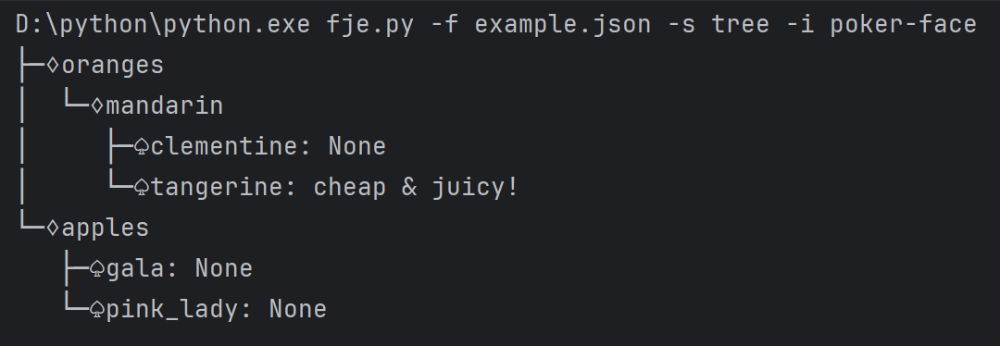
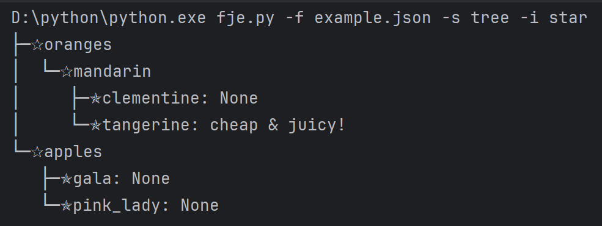
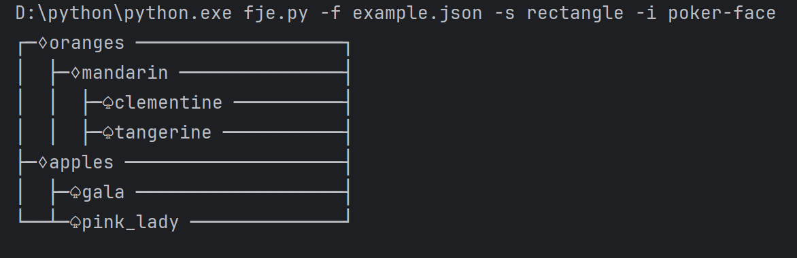
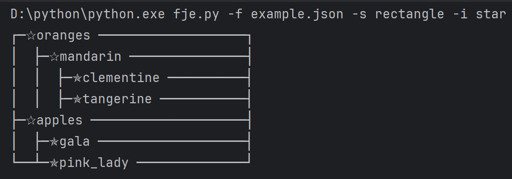

## 说明：
将代码重构为迭代器模式与访问者模式的结合：  
**创建迭代器**：用于遍历 JSON 数据。  
**创建访问者**：用于不同的可视化方式（树形和矩形）。

1. 定义迭代器: `JSONIterator` 用于深度优先遍历 JSON 数据结构。
2. 定义访问者接口和具体访问者: `JSONVisitor`是访问者基类，定义了 visit 方法。具体访问者实现了不同的可视化逻辑，`TreeJSONVisitor`和`RectangleJSONVisitor` 。
3. `JSONVisualizerFactory`：工厂类用于创建具体访问者


## 四个截图




## 运行示例： 

```shell 
python fje.py -f example.json -s tree -i poker-face
```
```
├─♢oranges
│  └─♢mandarin
│     ├─♤clementine: None
│     └─♤tangerine: cheap & juicy!
└─♢apples
   ├─♤gala: None
   └─♤pink_lady: None
```
```shell 
python fje.py -f example.json -s tree -i star
```
```
├─✰oranges
│  └─✰mandarin
│     ├─✯clementine: None
│     └─✯tangerine: cheap & juicy!
└─✰apples
   ├─✯gala: None
   └─✯pink_lady: None
```
```shell 
python fje.py -f example.json -s tree 
```
```
├─ oranges
│  └─ mandarin
│     ├─ clementine
│     └─ tangerine: cheap & juicy!
└─ apples
   ├─ gala
   └─ pink_lady

```
或者

```shell 
python fje.py -f example.json -s rectangle 
```
```
┌─ oranges ───────────────────┐
│  ├─ mandarin ───────────────┤
│  │  ├─ clementine ──────────┤
│  │  ├─ tangerine ───────────┤
├─ apples ────────────────────┤
│  ├─ gala ───────────────────┤
└──┴─ pink_lady ──────────────┘
```
```shell 
python fje.py -f example.json -s rectangle -i poker-face
```
```
┌─♢oranges ───────────────────┐
│  ├─♢mandarin ───────────────┤
│  │  ├─♤clementine ──────────┤
│  │  ├─♤tangerine ───────────┤
├─♢apples ────────────────────┤
│  ├─♤gala ───────────────────┤
└──┴─♤pink_lady ──────────────┘
```
```shell 
python fje.py -f example.json -s rectangle -i star
```
```
┌─✰oranges ───────────────────┐
│  ├─✰mandarin ───────────────┤
│  │  ├─✯clementine ──────────┤
│  │  ├─✯tangerine ───────────┤
├─✰apples ────────────────────┤
│  ├─✯gala ───────────────────┤
└──┴─✯pink_lady ──────────────┘
```